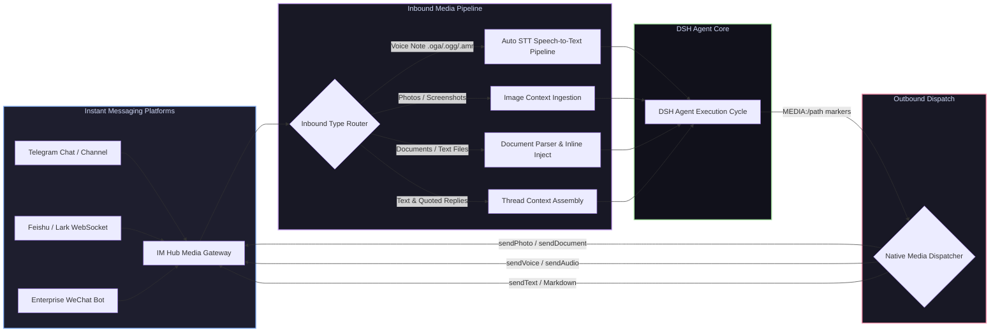

# 📦 @goodandready/dsh-im-hub-media

<div align="center">

<h3>Multi-Platform Instant Messaging Gateway with Full Voice STT & Bidirectional Media Dispatch for DeepSeek Harness</h3>

<p align="center">
  <a href="https://www.npmjs.com/package/@goodandready/dsh-im-hub-media"></a>
  <a href="LICENSE"></a>
  <a href="https://github.com/topics/dsh-plugin"></a>
  <a href="https://nodejs.org"></a>
</p>

<p align="center">
  <a href="README.md"><b>🇬🇧 English</b></a> •
  <a href="README.ru.md"><b>🇷🇺 Русский</b></a> •
  <a href="README.zh.md"><b>🇨🇳 中文说明</b></a>
</p>

</div>

---

## ⚡ Overview

**`dsh-im-hub-media`** turns your **DeepSeek Harness** agents into 24/7 conversational assistants across **Telegram**, **Feishu (Lark)**, and **Enterprise WeChat (WeCom)** with automated speech-to-text voice transcription and bidirectional media exchange.

Unlike standard text-only bots, `dsh-im-hub-media` handles voice notes, photos, documents, and replies seamlessly, allowing agents to respond with rich media, synthesized audio, or files using native platform message formats.



---

## ✨ Platform Capabilities & Media Superpowers

### 1. Telegram Adapter
* 🎙️ **Incoming Voice Transcription (STT)**: Voice notes (`.oga`/`.ogg`) are automatically intercepted, transcribed via host STT chains (e.g. `dsh-voice`), and injected as natural text.
* 🖼️ **Incoming Photos & Captions**: Photos are downloaded and passed directly to vision-capable models or through `dsh-vision-bridge`.
* 📄 **Document & File Handling**: Hermes-style extension filtering, configurable size caps, and small text/code file inline injection.
* 💬 **Quoted Replies & Thread Context**: Replying to a previous message preserves conversation history and context automatically.
* 📤 **Outbound Media Dispatch**: Agents emit `MEDIA:/absolute/path` markers in their reply; the plugin strips the marker and dispatches native `sendPhoto`, `sendVoice`, or `sendDocument` payloads.

### 2. Feishu (Lark) Adapter
* ⚡ **WebSocket & Webhook Gateway**: Instant bi-directional messaging over persistent WebSocket connection (`feishu-ws-frame`) or webhook callbacks.
* 📇 **Interactive Message Cards**: Renders structured markdown, interactive buttons, and event callbacks.
* 📁 **Rich Audio & Document Exchange**: Native handling of Feishu voice notes (`opus`/`amr`), images, and file attachments.

### 3. Enterprise WeChat (WeCom) Adapter
* 🔒 **Secure Enterprise Gateway**: Built-in XML/JSON message encryption/decryption.
* 👥 **Bot & Application Integration**: Supports both webhook group bots and full enterprise internal applications.

---

## 🔒 Security & Access Control

* **User & Chat Allowlists**: Restrict agent access using `allowedUsers` and `allowedChats` ID filters.
* **Session & Workspace Isolation**: Each chat maintains an independent session state, preventing context cross-talk.
* **Credentials Resolution**: Bot tokens (`TELEGRAM_BOT_TOKEN`, `FEISHU_APP_SECRET`, etc.) are resolved via the host Credentials service.

---

## 📦 Quick Installation

```bash
dsh plugin --profile web add @goodandready/dsh-im-hub-media
```

> [!IMPORTANT]
> Restart DSH after installation (`systemctl --user restart dsh-web`) to mount the IM hub adapter tree.

---

## ⚙️ Configuration Example (`settings.yaml`)

```yaml
dsh-im-hub-media:
  adapters:
    telegram:
      enabled: true
      tokenEnv: TELEGRAM_BOT_TOKEN
      allowedUsers: ["123456789"]
      sttProvider: auto
      downloadMediaDir: data/im/media
    feishu:
      enabled: false
      appId: cli_xxx
      appSecretEnv: FEISHU_APP_SECRET
    wecom:
      enabled: false
      corpId: ww_xxx
      secretEnv: WECOM_SECRET
```

---

## 📄 License

MIT © [GooDAnDReaDY](https://github.com/GooDAnDReaDY)
