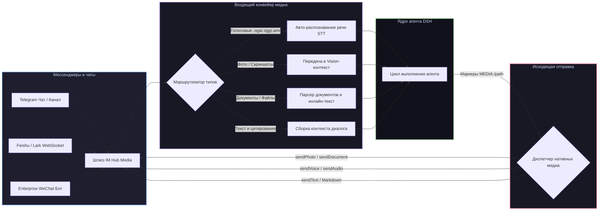

# 📦 @goodandready/dsh-im-hub-media

<div align="center">

<h3>Многоплатформенный IM-шлюз с поддержкой голосовых сообщений (авто-STT) и двусторонней отправкой медиафайлов для DeepSeek Harness</h3>

<p align="center">
  <a href="https://www.npmjs.com/package/@goodandready/dsh-im-hub-media"></a>
  <a href="LICENSE"></a>
  <a href="https://github.com/topics/dsh-plugin"></a>
  <a href="https://nodejs.org"></a>
</p>

<p align="center">
  <a href="https://goodandready.app/"></a>
</p>

<p align="center">
  <a href="README.md"><b>🇬🇧 English</b></a> •
  <a href="README.ru.md"><b>🇷🇺 Русский</b></a> •
  <a href="README.zh.md"><b>🇨🇳 中文说明</b></a>
</p>

</div>

---

## ⚡ Обзор

**`dsh-im-hub-media`** превращает ваших агентов **DeepSeek Harness** в круглосуточных ассистентов в мессенджерах **Telegram**, **Feishu (Lark)** и **Enterprise WeChat (WeCom)** с автоматическим распознаванием голосовых сообщений и полноценным двусторонним обменом медиафайлами.

В отличие от простых текстовых ботов, плагин обрабатывает голосовые сообщения, фотографии, документы и цепочки ответов (Replies), позволяя агенту отвечать нативными медиа-вложениями, синтезированным голосом и файлами.



---

## ✨ Возможности платформ и работа с медиа

### 1. Адаптер Telegram
* 🎙️ **Распознавание входящих голосовых (STT)**: голосовые заметки (`.oga`/`.ogg`) автоматически перехватываются, транскрибируются через STT-цепочку (например, `dsh-voice`) и передаются агенту в виде текста.
* 🖼️ **Входящие фото и скриншоты**: изображения передаются моделям зрения или обрабатываются через `dsh-vision-bridge`.
* 📄 **Обработка документов**: фильтрация по белому списку расширений в стиле Hermes, лимиты на размер и инъекция содержимого текстовых/кодовых файлов.
* 💬 **Цитирование и цепочки ответов**: ответ на предыдущее сообщение автоматически подтягивает исходный контекст.
* 📤 **Нативная отправка медиа**: агент может указать маркер `MEDIA:/абсолютный/путь` в ответе — плагин вырежет маркер и отправит нативное фото, голосовое или документ пользователю.

### 2. Адаптер Feishu (Lark)
* ⚡ **WebSocket и Webhook шлюз**: постоянное соединение через WebSocket (`feishu-ws-frame`) или webhook-события.
* 📇 **Интерактивные карточки**: рендеринг форматированного Markdown, интерактивных кнопок и форм.
* 📁 **Голосовые и файлы**: прием и отправка аудио (`opus`/`amr`), картинок и вложений.

### 3. Адаптер Enterprise WeChat (WeCom)
* 🔒 **Корпоративная безопасность**: встроенное шифрование/дешифрование XML/JSON сообщений.
* 👥 **Боты и приложения**: поддержка групповых ботов и внутренних корпоративных приложений.

---

## 🔒 Безопасность и контроль доступа

* **Белые списки пользователей и чатов**: фильтрация доступа через `allowedUsers` и `allowedChats`.
* **Изоляция сессий**: каждый чат работает в отдельном изолированном контексте.
* **Безопасные секреты**: токены ботов читаются из хранилища Credentials хоста.

---

## 📦 Быстрая установка

```bash
dsh plugin --profile web add @goodandready/dsh-im-hub-media
```

---

## ⚙️ Пример конфигурации (`settings.yaml`)

```yaml
dsh-im-hub-media:
  adapters:
    telegram:
      enabled: true
      tokenEnv: TELEGRAM_BOT_TOKEN
      allowedUsers: ["123456789"]
      sttProvider: auto
      downloadMediaDir: data/im/media
    feishu:
      enabled: false
      appId: cli_xxx
      appSecretEnv: FEISHU_APP_SECRET
    wecom:
      enabled: false
      corpId: ww_xxx
      secretEnv: WECOM_SECRET
```

---

## 📄 Лицензия

MIT © [GooDAnDReaDY](https://github.com/GooDAnDReaDY)
