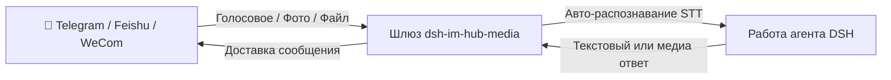

# 📦 @goodandready/dsh-im-hub-media

<div align="center">

<h3>Многоплатформенный IM-шлюз с поддержкой голосовых сообщений (авто-STT) и медиафайлов</h3>

<p align="center">
  <a href="https://www.npmjs.com/package/@goodandready/dsh-im-hub-media"></a>
  <a href="LICENSE"></a>
  <a href="https://github.com/topics/dsh-plugin"></a>
  <a href="https://nodejs.org"></a>
</p>

<p align="center">
  <a href="README.md"><b>🇬🇧 English</b></a> •
  <a href="README.ru.md"><b>🇷🇺 Русский</b></a> •
  <a href="README.zh.md"><b>🇨🇳 中文说明</b></a>
</p>

</div>

---

## ⚡ Обзор

**`dsh-im-hub-media`** подключает агентов DeepSeek Harness к **Telegram**, **Feishu (Lark)** и **Enterprise WeChat (WeCom)** с автоматическим распознаванием голосовых сообщений (STT) и пересылкой медиафайлов.



---

## 📦 Быстрая установка

```bash
dsh plugin --profile web add @goodandready/dsh-im-hub-media
```

---

## 📄 Лицензия

MIT © [GooDAnDReaDY](https://github.com/GooDAnDReaDY)
