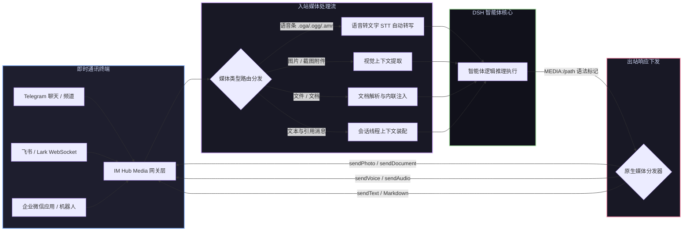

# 📦 @goodandready/dsh-im-hub-media

<div align="center">

<h3>DeepSeek Harness 多平台即时通讯媒体网关（支持语音转写与双向富媒体收发）</h3>

<p align="center">
  <a href="https://www.npmjs.com/package/@goodandready/dsh-im-hub-media"></a>
  <a href="LICENSE"></a>
  <a href="https://github.com/topics/dsh-plugin"></a>
  <a href="https://nodejs.org"></a>
</p>

<p align="center">
  <a href="https://goodandready.app/"></a>
</p>

<p align="center">
  <a href="README.md"><b>🇬🇧 English</b></a> •
  <a href="README.ru.md"><b>🇷🇺 Русский</b></a> •
  <a href="README.zh.md"><b>🇨🇳 中文说明</b></a>
</p>

</div>

---

## ⚡ 插件概览

**`dsh-im-hub-media`** 将 **DeepSeek Harness** 智能体接入 **Telegram**、**飞书 (Lark)** 与 **企业微信 (WeCom)**，实现 7x24 小时即时通讯交互、语音条自动转写及双向富媒体消息收发。

不同于传统纯文本机器人，本插件全面打通语音条、图片附件、文档以及引用回复 (Replies)，支持智能体通过原生媒体消息（图片、语音条、文件）即时回复用户。



---

## 📦 安装指南

```bash
dsh plugin --profile web add @goodandready/dsh-im-hub-media
```

---

## 📄 开源协议

MIT © [GooDAnDReaDY](https://github.com/GooDAnDReaDY)
